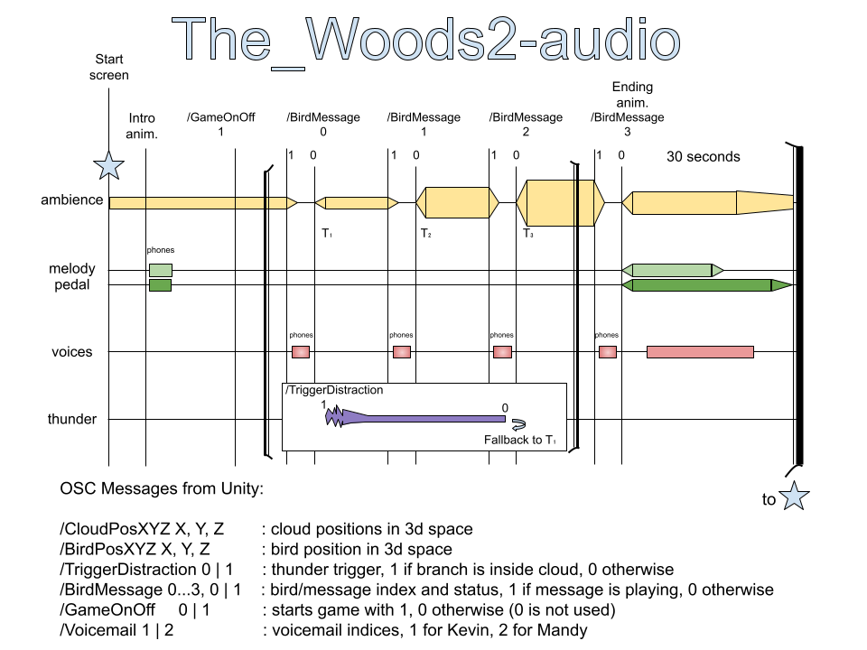
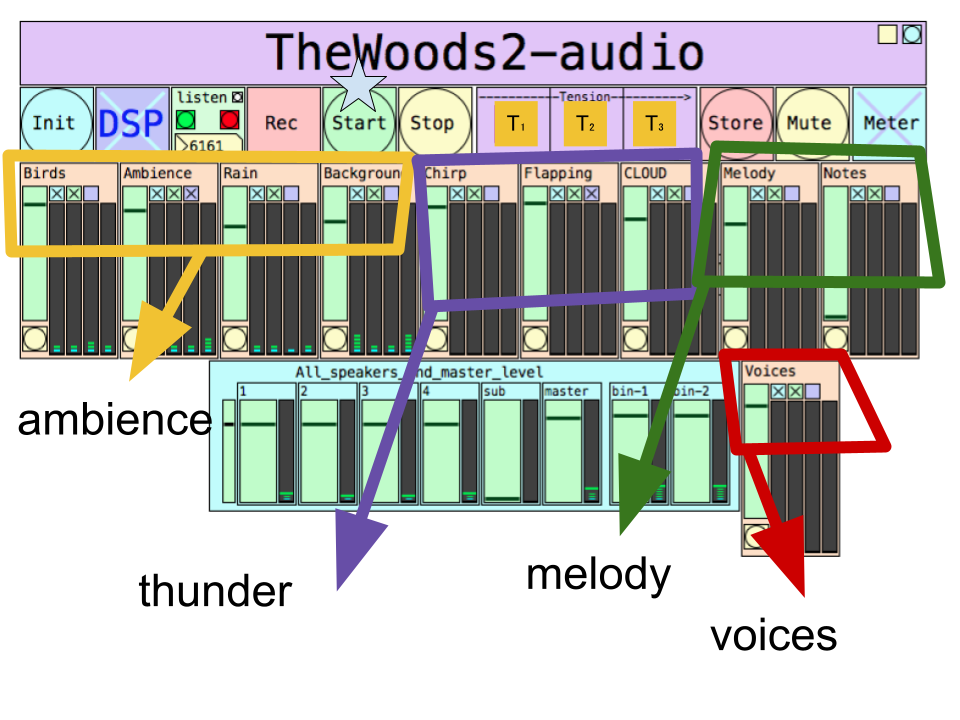

# TheWoods_2-audio

This repository contains the audio part for [The Woods AR game](https://github.com/kropcke/TheWoods_2). 

Head to the [releases](https://github.com/fdch/TheWoods_2-audio/releases) page for the latest build.

## Instructions

Download the `.zip` file inside the releases pages. Unpack the file in your folder of preference. Now, you can open the app:

1. Double-click on the executable file for your system.
2. First time only: If prompted to create a directory, please click "Yes"
3. First time only: If prompted with allowing microphone access, please select "Yes" or "Allow". 
2. Once the application has opened: select "stereo" or "quad" on the top-left corner of the patch window. The default is "stereo". You can change this depending on your setup.

## Stereo

The default is a stereo (2-channel) setup, so you can run this with your computer connected to two speakers (or headphones) for testing.

## Quad

If you have 4 speakers and an audio interface with 4 (or more) channels, you can select the "quad" setup. You will also need to do the following (only once) inside the Pd application
1. Connect your audio interface to your computer
2. Open the Pd executable
3. In PD, go to `Pd > Preferences > Audio Preferences`. This will open a pop-up window in which you can select your audio interface.
4. Under the "Input Devices" and "Output Devices" menues, select your audio interface.
5. You need to specify the number of channels on the right number input box. 
6. Finally, click "Save All Settings" and then "OK". 

If all is correct, audio should now be sent to channels 1-4 of your audio interface.

ADVANCED: if you open channels 5 and 6 in 'quad' mode, you can route a binaural rendering of the experience for recording.

## Score

## Patch Reference

## Acknowledgments

- Kyoung and Scott Swearingen
- Marc Ainger
- Miller Puckette
- IOhannes Zmölnig
- Thomas Musil (iem_ambi)
- Ville Pulkki (vbap)
- The Pd Community in general
